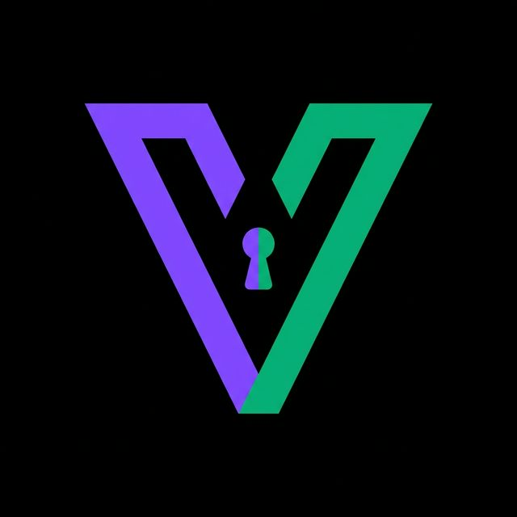
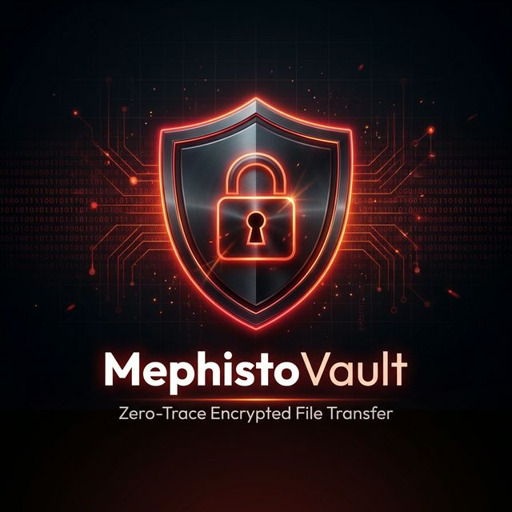

# 🛡️ MephistoVault — Zero-Trace, Peer-to-Peer Encrypted File Transfer & Ephemeral Privacy Drop

<p align="center">
  <a href="https://mephistoshares.online">
    
  </a>
</p>

<p align="center">
  <strong>The ultra-fast, serverless, browser-to-browser encrypted file sharing platform powered by WebRTC & AES-256-GCM.</strong><br>
  <em>No cloud storage. No file size limits. No accounts. Files stream directly between devices and vanish without a trace.</em>
</p>

<p align="center">
  <a href="https://mephistoshares.online"></a>
  <a href="https://mephistomail.site"></a>
  <a href="https://github.com/jokallame350-lang/mephistovaultt"></a>
</p>

<p align="center">
  
  
  
  
  
  
  
  
</p>

---

## ⚡ The Fundamental Problem with Modern File Sharing

When you upload files to **WeTransfer, Google Drive, Dropbox, or Telegram**:
1. 🏢 **Your data sits on third-party disks** where algorithms can inspect, index, and analyze it.
2. ⏳ **Arbitrary file size limits** (e.g. 2GB free caps) force you to buy expensive subscriptions.
3. 🐌 **Artificial bandwidth throttling** slows down transfers between two computers on the same network.
4. 📋 **You leave a persistent digital paper trail** tying your IP address and identity to every file.

---

## 🎯 The MephistoVault Solution

**MephistoVault re-engineers file transfer from the ground up:**

- 🔗 **Direct Device-to-Device WebRTC Tunnel:** Files stream directly from your RAM to the recipient's RAM at full network line speed.
- ☁️ **0 Bytes Server Storage:** Our server only facilitates the initial encrypted WebRTC handshake (SDP exchange). **Your actual files never touch our servers.**
- 🔐 **End-to-End Military Cryptography:** Data is encrypted locally in your browser using **AES-256-GCM** with PBKDF2 key derivation before transmission.
- 📱 **Universal Cross-Platform AirDrop (iOS, Android, Windows, Mac, Linux):** Transfer files from PC to iPhone/Android simply by scanning an on-screen QR code with your native camera app. No apps to install.
- ⏱️ **Burn-on-Read Self-Destruction:** The millisecond the transfer finishes or a tab closes, all encryption keys, ephemeral WebRTC data channels, and RAM buffers are permanently wiped.

---

## 📸 Interface Preview

<p align="center">
  
</p>

---

## 🚀 Killer Features & Capabilities

### 1. 🚀 Unlimited File Size & Full Line-Rate Speed
Transfer 4K raw video files, 50GB game backups, virtual machine images, or ISOs. Because data is never uploaded to an intermediate cloud server, you transfer at the **full local LAN speed (up to 1+ Gbps)** or your maximum ISP bandwidth without caps.

### 2. 📱 Instant QR Code Mobile Handoff
Need to send photos or videos from your iPhone/Android to your PC?
1. Open [mephistoshares.online](https://mephistoshares.online) on your PC.
2. Scan the on-screen QR code with your mobile camera.
3. Select files on your phone — they download straight onto your PC in real-time.

### 3. 📦 In-Browser Folder Archiving (Client-Side JSZip)
Drag-and-drop an entire nested directory containing hundreds of code files or photo albums. MephistoVault automatically bundles them into an encrypted ZIP package directly in your browser's memory without touching the disk.

### 4. 💬 Phantom E2E Chat & Live Code Scratchpad
Need to share confidential API keys, passwords, or code snippets alongside your files?
- **Phantom Chat:** Instant end-to-end encrypted messaging with zero server logging.
- **Collaborative Scratchpad:** Live code/text editor that streams keystrokes securely between peers.

### 5. 📻 Encrypted Voice Walkie-Talkie Mode
Collaborate live during big transfers using browser-to-browser encrypted Push-to-Talk audio streaming.

### 6. 🎨 3 Stunning Visual Themes
- **Dark Onyx:** Minimalist, battery-saving dark interface.
- **Cyberpunk Neon:** High-tech glowing neon HUD for gamers and power users.
- **Clean Light:** High-contrast daylight view for office environments.

---

## 📊 Comparison Matrix

| Feature | 🛡️ MephistoVault | WeTransfer | Google Drive | Apple AirDrop | Wormhole |
| :--- | :---: | :---: | :---: | :---: | :---: |
| **Server File Storage** | **0 Bytes (None)** | 100% on Cloud | 100% on Cloud | 0 Bytes | Cloud Upload |
| **Max File Size Limit** | **UNLIMITED** | 2 GB Free Cap | 15 GB Cap | Unlimited | 5 GB Cap |
| **Cross-Platform Support** | **All Browsers & OS** | Web | Web / App | Apple Only | Web |
| **Account Required** | **NO (1-Click)** | Yes / Email | Yes (Google) | Apple ID | No |
| **Transfer Speed** | **Full Line Speed (P2P)** | Cloud Throttled | Cloud Throttled | Local Wi-Fi | Cloud Throttled |
| **End-to-End Encryption** | **AES-256-GCM** | Server-side only | Server-side only | Proprietary | Yes |
| **Self-Destruct on Finish** | **Instant (Zero Trace)** | Days / Weeks | Permanent | N/A | 24 Hours |
| **QR Code Phone Scan** | **Native Camera Scan** | No | No | No | No |
| **Open Source Audit** | **100% Open Source** | Closed | Closed | Closed | Partial |

---

## 🏗️ Technical Architecture & Protocol

```
                        ┌─────────────────────────────────────────┐
                        │          Sender Web Browser             │
                        │  (React 19 + TypeScript + Web Crypto)   │
                        └────────────────────┬────────────────────┘
                                             │
                       ┌─────────────────────┴─────────────────────┐
                       │                                           │
          1. Signaling Handshake                       2. Encrypted File Stream
         (Ephemeral SDP / ICE / PIN)                   (Chunked WebRTC DataChannel)
                       │                                           │
                       ▼                                           │
         ┌───────────────────────────┐                             │
         │   Stateless PeerJS Relay  │                             │
         │  • Zero File Data / No DB │                             │
         │  • 100% Ephemeral Memory  │                             │
         └─────────────┬─────────────┘                             │
                       │                                           │
                       └─────────────────────┬─────────────────────┘
                                             │
                                             ▼
                        ┌─────────────────────────────────────────┐
                        │         Receiver Web Browser            │
                        │  (Direct RAM-to-RAM File Reassembly)    │
                        └─────────────────────────────────────────┘
```

1. **Cryptographic Key Exchange:** The sender creates a room and derives an ephemeral AES-GCM-256 session key from a CSPRNG-generated room code via PBKDF2 (100,000 iterations).
2. **WebRTC Direct P2P Channel:** Browsers establish a direct UDP/TCP DataChannel via STUN/TURN ICE candidates.
3. **Chunked Streaming (ArrayBuffer):** Files are sliced into 64KB binary chunks, encrypted on-the-fly, streamed across the DataChannel, and reassembled in volatile memory on the receiver's end.
4. **Instant Zero-Fill:** As soon as the file download completes, all memory buffers are wiped with zeroes.

---

## 🚀 Quickstart & Local Development

### Prerequisites
- Node.js 18.0 or higher
- npm or yarn

```bash
# 1. Clone the repository
git clone https://github.com/jokallame350-lang/mephistovaultt.git

# 2. Navigate to directory
cd mephistovaultt

# 3. Install dependencies
npm install

# 4. Start local development server
npm run dev
```
Open [http://localhost:5173](http://localhost:5173) in your browser.

### Production Build
```bash
npm run build
npm run preview
```

---

## 🌐 The Mephisto Privacy Ecosystem

MephistoVault is part of the **Mephisto Open-Source Privacy Suite**:

- 📧 **[MephistoMail](https://mephistomail.site)** — Next-gen RAM-only disposable email & 1-second OTP verification shield.
- 🛡️ **[MephistoVault](https://mephistoshares.online)** — Zero-trace P2P encrypted file sharing.
- 🧹 **[MephistoCleaner](https://github.com/jokallame350-lang/mephistocleaner)** — 150+ toggle Windows 10/11 system optimizer & privacy debloater.
- 🌐 **[Mephisto Translate](https://github.com/jokallame350-lang/translation)** — Instant on-screen floating HUD translator.

---

## 📜 Security & Responsible Disclosure

- **Zero Logging:** MephistoVault never collects IP addresses, telemetry, or file metadata.
- **Client-Side Verification:** All cryptography runs exclusively inside your browser via the standard W3C `crypto.subtle` API.
- **Vulnerability Reporting:** If you find a security issue, please contact our security team at [jokallame0@gmail.com](mailto:jokallame0@gmail.com).

---

## 👤 Creator & Maintainer

Engineered with ❤️ by **Mert Can Yıldız**.

- **GitHub:** [@jokallame350-lang](https://github.com/jokallame350-lang)
- **Email:** [jokallame0@gmail.com](mailto:jokallame0@gmail.com)
- **Live Platform:** [https://mephistoshares.online](https://mephistoshares.online)

---

## ⭐ Star History

If you love private, decentralized, serverless file transfers, please **Star this repository** on GitHub! ⭐

<p align="center">
  <a href="https://github.com/jokallame350-lang/mephistovaultt">
    
  </a>
</p>

---

<p align="center">
  Distributed under the <strong>MIT License</strong>. Copyright © 2026 MephistoVault.
</p>
